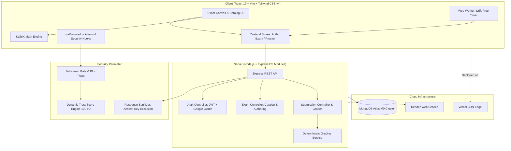

<div align="center">

# 🎓 Mock Test Canvas

### Enterprise-Grade AI-Proctored Computer-Based Testing Platform
**Engineered for High-Stakes Competitive Examinations (JEE Advanced, NEET, GATE & Aptitude)**

[](https://mock-test-canvas.vercel.app)
[](https://mock-test-canvas.onrender.com/api/health)
[](https://react.dev/)
[](https://tailwindcss.com/)
[](https://nodejs.org/)
[](https://www.mongodb.com/atlas)

<p align="center">
  <a href="#-key-features">Key Features</a> •
  <a href="#-architecture--tech-stack">Tech Stack</a> •
  <a href="#-security--proctoring-engine">Proctoring Engine</a> •
  <a href="#-project-directory-structure">Project Structure</a> •
  <a href="#-environment-configuration">Configuration</a> •
  <a href="#-getting-started">Getting Started</a> •
  <a href="#-api-documentation">API Reference</a>
</p>

</div>

---

## 🌟 Executive Summary

**Mock Test Canvas** is a production-grade, full-stack assessment portal replicating the authentic interface and rigorous constraints of national-level computer-based examinations (such as India's **NTA JEE Advanced / Main**, **NEET**, and **GATE**).

Built with **React 19**, **Tailwind CSS v4**, **Node.js/Express**, and **MongoDB Atlas**, it combines:
- An **authentic national-grade exam canvas** with KaTeX LaTeX math rendering and multi-format question support.
- An **active client-side anti-cheat lockdown** with fullscreen enforcement, tab/window traps, input suppression, and a zero-drift Web Worker countdown clock.
- A **Dynamic Trust Score Engine** ($100 \rightarrow 0$) that penalizes infractions and enforces auto-termination upon integrity exhaustion.
- A **deterministic server-side grading engine** that strictly safeguards answer keys and handles complex marking schemes (+4 / -1, negative scoring).
- An **Exam Authoring Studio** enabling creators to configure custom tests with attempt limits, live LaTeX preview, and granular proctoring rules.

---

## 🎯 Key Features

### 1. 🖥️ Authentic National Exam Player
- **STEM Formula Engine (KaTeX)**: Flawless client-side rendering of complex LaTeX formulas, matrices, integrals, fractions, chemical equations, and Greek symbols.
- **Multi-Format Question Canvas**: Native handling of Single-Choice (MCQ), Multi-Choice (MSQ), and Numerical Answer Type (NAT) questions.
- **Persistent Session State**: Powered by Zustand and `localStorage` syncing; accidental browser crashes or reloads restore answers and timer seamlessly without losing progress.

### 2. 🛡️ Advanced In-Browser Lockdown & Proctoring
- **Zero-Drift Web Worker Timer**: Solves browser background tab throttling. Uses a dedicated Web Worker running on `performance.now()` delta timestamps, combined with wall-clock reconciliation on tab return.
- **Fullscreen Enforcer with Gesture Gate**: Requires full-screen mode to test. Detects exit immediately, blocks interface with an unclosable lock overlay, records infractions, and handles browser auto-fullscreen permissions via user-gesture gates.
- **Tab & Window Focus Traps**:
  - Monitors the **Page Visibility API** (`visibilitychange`) to trap tab-switching.
  - Intercepts **Window Blur** (`blur`) for Alt+Tab detection.
  - Intelligent co-fire debouncer eliminates false-positive double strikes when switching tabs triggers both blur and visibility events simultaneously.
- **Wall-Clock Tab Return Correction & Extended Absence**: If a user switches tabs, real elapsed time is subtracted from the exam clock upon return. Absences exceeding 30 seconds trigger scaled `EXTENDED_ABSENCE` violations (up to -20 trust penalty).
- **Suppression of DevTools & Shortcuts**:
  - Disables right-click context menu (`contextmenu`).
  - Intercepts clipboard shortcuts: Copy (`Ctrl+C`), Cut (`Ctrl+X`), Paste (`Ctrl+V`), Select All (`Ctrl+A`).
  - Blocks DevTools & browser shortcuts: `F12`, `Ctrl+Shift+I`, `Ctrl+Shift+J`, `Ctrl+Shift+C`, `Ctrl+Shift+K`, `Ctrl+U` (View Source), `Ctrl+S`, `Ctrl+P`, and `Alt+F4`.

### 3. ⚖️ Tiered Trust Score Engine ($100 \rightarrow 0$)
- Candidates start each test with a pristine **100 Trust Score**.
- Violations trigger tiered penalties proportional to intent:
  - **Fullscreen Exit**: `-20 pts` (deliberate drop out)
  - **Tab Switch**: `-15 pts` (high cheat risk)
  - **Extended Absence (>30s)**: `-10` to `-20 pts` (scaled by duration away)
  - **Window Focus Lost**: `-10 pts` (potential background application lookup)
- **10-Second Cooldown**: Prevents rapid multi-penalty stacking from single accidental events.
- **Early Warning Threshold**: An alert modal triggers when the trust score drops to $\le 30$.
- **Automated Termination**: When trust drops to $0$, a 5-second countdown modal activates, automatically terminating and submitting the candidate's paper.
- **Cross-Session Persistence & Exam Scoping**: Trust scores and violations persist across page refreshes for the active exam, preventing candidates from clearing penalties with F5.

### 4. 🧮 Deterministic Server-Side Grading Engine
- **Zero Client Answer Exposure**: The `GET /api/exams/:id` endpoint explicitly projects out `correctAnswers` and `explanation` via Mongoose (`-correctAnswers -explanation`), preventing answers from being snooped in the Network tab.
- **Server Evaluation**: Scores are computed deterministically on the backend (`grading.service.js`) using authentic exam rules:
  - Positive marks for correct selections.
  - Negative marks for incorrect answers.
  - Multi-select matching validation.
  - Numerical range bounds verification for NAT.
- **Attempt Tracking & History**: Retains historical attempts with timestamps, scores, percentage accuracy, question breakdown, and audit logs.

### 5. ✍️ Test Authoring Studio & Catalog
- **Test Creator Studio (`/create-test`)**: Build customized exams with title, category, duration, custom marking schemes (+4 / -1, etc.), configurable attempt limits, and toggleable proctoring constraints.
- **Live KaTeX Question Preview**: Split-view editor previewing math equations and option blocks in real time.
- **Exam Catalog & Search**: Filter tests by category (`JEE`, `NEET`, `GATE`, `APTITUDE`, `CUSTOM`) or search by title with pagination.
- **Exam Detail Page (`/test/:testId`)**: Review test syllabus, rules, attempt quotas, and your historical best scores before starting.

### 6. 🔐 Dual Authentication: JWT & Google OAuth
- Traditional registration/login with email and **bcrypt** salted password hashing.
- Native **Google OAuth 2.0** integration (`google-auth-library`) for instant one-tap candidate sign-in.
- Stateless, cryptographically signed JSON Web Tokens (JWT).

---

## 🏗️ Architecture & Tech Stack



### Layer-by-Layer Technology Matrix

| Domain | Technology | Purpose & Responsibility |
| :--- | :--- | :--- |
| **Frontend Framework** | **React 19.2 + Vite 8.2** | Next-generation React build with concurrent rendering and instant HMR. |
| **Styling & Design** | **Tailwind CSS v4.3** | High-performance CSS engine with glassmorphism, responsive breakpoints, and dark mode. |
| **State Management** | **Zustand 5.0** | Atomic client stores (`useAuthStore`, `useExamStore`, `useProctorStore`) with `persist` middleware. |
| **Math Typography** | **KaTeX 0.18** | High-speed, TeX-compliant math formula rendering for complex STEM equations. |
| **Icons & UI Extras**| **Lucide React + Canvas Confetti** | Crisp modern iconography and celebratory confetti upon test submission. |
| **Backend Framework**| **Node.js + Express 4.21** | ES Modules server with async routing and structured JSON middleware. |
| **Database & ODM** | **MongoDB Atlas + Mongoose 8.9** | Cloud document database with strict schema models (`User`, `Exam`, `Question`, `Attempt`). |
| **Authentication** | **JWT + Google Auth Library** | Dual stateless auth: 30-day signed tokens + Google OAuth ID Token verification. |
| **Security & Limits** | **Express Rate Limit + CORS** | In-memory API rate limiter and strict origin whitelist. |
| **AI Integration** | **@google/genai (Gemini API)** | Diagnostic reporting and step-by-step STEM problem explanation pipeline. |
| **Hosting & CI/CD** | **Vercel (Client) + Render (API)** | Production edge routing with HTTPS and CORS parity. |

---

## 📁 Project Directory Structure

```plaintext
mock-test-canvas/
├── client/                                # React 19 Frontend Application
│   ├── index.html                         # SPA Entry HTML
│   ├── package.json                       # Frontend dependencies & scripts
│   ├── vite.config.js                     # Vite + Tailwind plugin setup
│   ├── vercel.json                        # SPA routing & Cross-Origin header rewrites
│   ├── .env.example                       # Client environment template
│   └── src/
│       ├── main.jsx                       # Application bootstrapping
│       ├── App.jsx                        # React Router layout & protected routes
│       ├── index.css                      # Tailwind CSS v4 entry & theme directives
│       ├── components/
│       │   ├── common/
│       │   │   ├── Navbar.jsx             # Top navigation bar with user profile & logout
│       │   │   ├── MathRenderer.jsx       # KaTeX equation parser & inline math renderer
│       │   │   ├── ProtectedRoute.jsx     # Auth guard redirecting unauthenticated users
│       │   │   └── Modal.jsx              # Reusable accessible dialog modal
│       │   ├── exam-player/               # Canonical testing player components
│       │   │   ├── ExamHeader.jsx         # Test title, section tabs, and countdown timer
│       │   │   ├── QuestionCanvas.jsx     # Active question statement, options & action buttons
│       │   │   └── QuestionPalette.jsx    # Question navigation grid
│       │   └── test-builder/
│       │       └── ManualQuestionForm.jsx # Question builder with live KaTeX preview
│       ├── hooks/
│       │   ├── useBrowserLockdown.js      # Fullscreen, tab visibility, blur & shortcut traps
│       │   └── useExamTimer.js            # Web Worker countdown timer interface
│       ├── pages/
│       │   ├── AuthPage.jsx               # Sign In / Sign Up with Google OAuth
│       │   ├── DashboardPage.jsx          # User overview, metrics & exam listings
│       │   ├── ExamCatalog.jsx            # Filterable test library with search
│       │   ├── ExamDetailPage.jsx         # Exam rules, syllabus & past attempt history
│       │   ├── ExamSessionPage.jsx        # Live exam testing canvas & proctored session
│       │   └── TestCreationPage.jsx       # Exam authoring studio with marking schemes
│       ├── services/
│       │   └── api.js                     # Axios instance with JWT interceptor & 401 handling
│       ├── store/
│       │   ├── useAuthStore.js            # Auth state, login/register/logout & me
│       │   ├── useExamStore.js            # Active question, answers map & local sync
│       │   └── useProctorStore.js         # Violations log, trust score & cooldowns
│       └── workers/
│           └── timer.worker.js            # Drift-free background Web Worker timer
│
├── server/                                # Node.js Express REST API
│   ├── package.json                       # Backend dependencies & scripts
│   ├── .env.example                       # Server environment template
│   └── src/
│       ├── server.js                      # Express initialization, CORS & route registry
│       ├── config/
│       │   └── db.js                      # MongoDB Atlas Mongoose connection
│       ├── models/
│       │   ├── User.model.js              # User profile, bcrypt hash, attempts tracking
│       │   ├── Question.model.js          # Question statement, type, options, answer key
│       │   ├── Exam.model.js              # Exam configuration, marking scheme, proctor toggles
│       │   └── Attempt.model.js           # Attempt submission, score, accuracy, violations
│       ├── middleware/
│       │   ├── auth.middleware.js         # JWT verification & req.user injection
│       │   └── rateLimiter.middleware.js  # Express rate limiting
│       ├── controllers/
│       │   ├── auth.controller.js         # Register, Login, Me, and Google OAuth
│       │   ├── exam.controller.js         # Create exam, List exams, Get sanitized exam
│       │   └── submission.controller.js   # Deterministic grading & user attempts query
│       ├── routes/
│       │   ├── auth.routes.js             # /api/auth endpoints
│       │   ├── exam.routes.js             # /api/exams endpoints
│       │   └── submission.routes.js       # /api/submissions endpoints
│       ├── services/
│       │   ├── grading.service.js         # Deterministic scoring algorithm (+4/-1, NAT, MSQ)
│       │   └── emailService.js            # Nodemailer / SMTP transactional emails
│       └── seeds/
│           ├── seed.js                    # Database seeder with sample questions
│           ├── seedDatabase.js            # Production seeder script
│           └── jee_adv_2024_paper1.json   # Authentic JEE Advanced 2024 Paper 1 dataset
│
├── vercel.json                            # Root deployment configuration
├── README_BLUEPRINT.md                    # Engineering blueprint & phase specifications
└── PLAN_OF_ACTION.md                      # Architecture roadmap & action plan
```

---

## 🔒 Security & Proctoring Matrix

| Cheat Vector | Threat Mechanism | Implemented Countermeasure | Result |
| :--- | :--- | :--- | :--- |
| **Answer Inspection** | Candidate checks DevTools / Network response for answers. | `GET /api/exams/:id` explicitly projects out `correctAnswers` and `explanation` (`select: '-correctAnswers -explanation'`). | **Answer keys never touch client memory** until graded on the server. |
| **Tab Hopping** | Candidate searches Google in another browser tab. | Page Visibility API hook records `TAB_SWITCH`, deducts `-15 pts`, and subtracts real elapsed wall-clock time on return. | Tab switch logged, alert modal triggers, timer penalizes time away. |
| **Application Swapping** | Candidate switches to Discord / WhatsApp / ChatGPT (`Alt+Tab`). | `window.onblur` event trap flags `WINDOW_BLUR` and deducts `-10 pts`. Co-fire debouncer ensures no double penalties with tab switch. | Warning overlay covers screen until candidate refocuses the exam. |
| **Fullscreen Dropping** | Candidate minimizes browser or opens split-screen notes. | `document.fullscreenchange` detects drop out, displays an unclosable blocker, and deducts `-20 pts`. | Candidate cannot view questions until re-engaging full-screen. |
| **Extended Backgrounding**| Candidate hides the tab for minutes to pause timer. | Tab return compares wall-clock `Date.now()` vs hidden timestamp; deducts all lost time. If $>30\text{s}$, extra deduction (`-10` to `-20 pts`). | Timer cannot be frozen by backgrounding. |
| **Keyboard Inspection** | Candidate presses `F12`, `Ctrl+Shift+I`, `Ctrl+U`, `Ctrl+S`. | `keydown` event listener blocks key combinations with `preventDefault()` and `stopPropagation()`. | DevTools shortcuts and source views completely neutralized. |
| **Clipboard Copying** | Candidate copies questions to send to third parties. | Intercepts `contextmenu`, `copy`, `cut`, `paste`, and `Ctrl+C/X/V/A`. | Text selection, right-click, and clipboard copying disabled. |
| **Page Refresh Reset** | Candidate reloads page (`F5`) to wipe violation count. | `useProctorStore` persists violation history, trust score, and active `examId` to `localStorage`. | Penalties and trust score survive page refreshes intact. |
| **Persistent Violations**| Candidate repeatedly ignores warnings. | If trust score drops $\le 30$, final warning triggers. At $0$, a 5-second countdown auto-submits the test. | Candidate is disqualified / auto-submitted with recorded audit trail. |
| **Attempt Retake Abuse** | Candidate clears cache to restart an exam repeatedly. | Server checks `Attempt.countDocuments()` against `exam.maxAttempts`. Exceeding limit returns `403 Forbidden`. | Candidate cannot bypass maximum attempt restrictions. |

---

## ⚙️ Environment Configuration

### 1. Server Configuration (`server/.env`)

Create a `.env` file in the `server/` folder:

```env
# Server Network Port
PORT=5000

# MongoDB Atlas Connection String
MONGODB_URI=mongodb+srv://<username>:<password>@cluster0.mongodb.net/ai_proctored_mock_tests?retryWrites=true&w=majority

# JWT Authentication Secret Key
JWT_SECRET=your_super_secret_jwt_signing_key_here

# Runtime Environment (development | production)
NODE_ENV=development

# Allowed Frontend Client URL (for CORS validation)
CLIENT_URL=http://localhost:5173

# Google OAuth Credentials (for Google Sign-In)
GOOGLE_CLIENT_ID=your_google_oauth_client_id.apps.googleusercontent.com
GOOGLE_CLIENT_SECRET=your_google_oauth_client_secret

# Optional: SMTP Email Configuration for Alerts / Password Resets
EMAIL_HOST=smtp.gmail.com
EMAIL_PORT=465
EMAIL_SECURE=true
EMAIL_USER=your_email@gmail.com
EMAIL_PASS=your_gmail_app_password
EMAIL_FROM="AI-Proctored Mock Tests" <your_email@gmail.com>

# Optional: Google Gemini API (for AI Diagnostics)
GEMINI_API_KEY=your_gemini_api_key_here
```

### 2. Client Configuration (`client/.env`)

Create a `.env` file in the `client/` folder:

```env
# API Base Endpoint (Point to local backend for dev, Render URL for production)
# Local:
VITE_API_BASE_URL=http://localhost:5000/api
# Production (Render):
# VITE_API_BASE_URL=https://mock-test-canvas.onrender.com/api

# Frontend URL
VITE_FRONTEND_URL=http://localhost:5173

# Google OAuth Client ID (must match backend GOOGLE_CLIENT_ID)
VITE_GOOGLE_CLIENT_ID=your_google_oauth_client_id.apps.googleusercontent.com
```

---

## 🚀 Getting Started

### Prerequisites
- **Node.js**: v18.0.0 or higher
- **npm**: v9.0.0 or higher
- **MongoDB Atlas**: Free M0 Cluster or local MongoDB instance

### Step 1: Clone the Repository
```bash
git clone https://github.com/Abhiram-Veerapaneni/easy-proctored-mock-tests.git
cd easy-proctored-mock-tests
```

### Step 2: Backend Setup & Seeding
```bash
cd server
npm install

# Configure your server/.env with your MongoDB Atlas URI & JWT_SECRET
cp .env.example .env

# Seed the database with official JEE Advanced 2024 Paper 1 questions
npm run seed

# Launch the development server (runs nodemon on port 5000)
npm run dev
```

> **Health Verification**: Visit `http://localhost:5000/api/health` in your browser. You should receive:
> ```json
> { "status": "ok", "timestamp": "...", "environment": "development" }
> ```

### Step 3: Frontend Setup & Launch
Open a second terminal window:
```bash
cd client
npm install

# Configure your client/.env
cp .env.example .env

# Launch the Vite development server (runs on port 5173)
npm run dev
```

> Open your browser and navigate to: **`http://localhost:5173`**

---

## 📡 API Documentation

All API endpoints are prefixed with `/api`. Protected routes require an `Authorization: Bearer <token>` header.

### 🔑 Authentication Endpoints (`/api/auth`)

| Method | Endpoint | Access | Description |
| :--- | :--- | :--- | :--- |
| `POST` | `/api/auth/register` | Public | Register user with `name`, `email`, `password`. Returns JWT and profile. |
| `POST` | `/api/auth/login` | Public | Authenticate user with `email` and `password`. Returns JWT and profile. |
| `POST` | `/api/auth/google` | Public | Authenticate via Google OAuth ID token (`credential`). Auto-provisions user. |
| `GET` | `/api/auth/me` | Protected | Returns authenticated user profile, populated with created and attempted tests. |

### 📝 Examination Endpoints (`/api/exams`)

| Method | Endpoint | Access | Description |
| :--- | :--- | :--- | :--- |
| `GET` | `/api/exams` | Public / Optional | List exams with query filters: `category`, `search`, `page`, `limit`. Includes user attempt counts. |
| `GET` | `/api/exams/:id` | Public / Protected | Get exam metadata and questions. **Answer keys and explanations are stripped** (`select: '-correctAnswers -explanation'`). |
| `POST` | `/api/exams` | Protected | Create exam with bulk questions, marking scheme, duration, and proctor toggles. |

### 📊 Submissions & Grading (`/api/submissions`)

| Method | Endpoint | Access | Description |
| :--- | :--- | :--- | :--- |
| `POST` | `/api/submissions/submit` | Protected | Submit completed exam answers & violation logs. Evaluated on backend; returns graded score and accuracy. |
| `GET` | `/api/submissions/my/:examId` | Protected | Retrieve all historical attempts by the authenticated user for a specific exam. |

### 💓 Health Check (`/api/health`)

| Method | Endpoint | Access | Description |
| :--- | :--- | :--- | :--- |
| `GET` | `/api/health` | Public | Returns service availability status, ISO timestamp, and active environment. |

---

## 🧪 Seeding & Test Data

The platform comes pre-packaged with authentic **JEE Advanced 2024 Paper 1** questions spanning:
- ⚛️ **Physics**: Mechanics, Rotational Dynamics, Electromagnetism, Modern Physics
- 🧪 **Chemistry**: Coordination Compounds, Organic Reaction Mechanisms, Thermodynamics
- 📐 **Mathematics**: Definite Integrals, Differential Equations, 3D Vectors, Probability

To seed or re-seed the test database:
```bash
cd server
npm run seed
```
This populates the database with real questions including LaTeX mathematical formulas (`\int_{0}^{\pi} ...`, `\sqrt{x}`, `\frac{d}{dx}`) ready for instant testing.

---

## 🚢 Deployment Guide

### Frontend Deployment (Vercel)
1. Push your repository to GitHub.
2. Link the repository on **Vercel**.
3. Set the **Root Directory** to `client`.
4. Add environment variables:
   - `VITE_API_BASE_URL`: `https://your-backend-service.onrender.com/api`
   - `VITE_GOOGLE_CLIENT_ID`: Your Google OAuth Client ID
   - `VITE_FRONTEND_URL`: `https://your-app.vercel.app`
5. Deploy. The bundled `client/vercel.json` ensures all SPA routes (`/dashboard`, `/test`, `/create-test`, `/test/:id`) rewrite correctly to `index.html`.

### Backend Deployment (Render)
1. Create a new **Web Service** on **Render**.
2. Set the **Root Directory** to `server`.
3. Set **Build Command** to `npm install`.
4. Set **Start Command** to `npm start`.
5. Add all environment variables from `server/.env` (`MONGODB_URI`, `JWT_SECRET`, `CLIENT_URL`, `GOOGLE_CLIENT_ID`, `GOOGLE_CLIENT_SECRET`, `NODE_ENV=production`).
6. Deploy and copy your service URL (e.g. `https://mock-test-canvas.onrender.com`).

---

## 🗺️ Roadmap & Upcoming Milestones

- [x] **Phase 1**: Monorepo Architecture, Unified Auth (JWT + Google OAuth), Database Contracts.
- [x] **Phase 2**: High-Fidelity Exam Player Canvas, KaTeX LaTeX Rendering, Multi-Format Inputs.
- [x] **Phase 3**: Browser Lockdown (Fullscreen gate, Page Visibility traps, DevTools suppression, drift-free Web Worker timer).
- [x] **Phase 4**: Dynamic Trust Score Engine ($100 \rightarrow 0$), tiered infraction penalties, auto-submission.
- [x] **Phase 5**: Exam Authoring Studio, customizable marking schemes, attempt quota restrictions.
- [x] **Phase 6**: Deterministic Server-Side Grading Engine & Attempt History Audit.
- [ ] **Phase 7**: Edge ML Computer Vision Proctoring (MediaPipe Face & Gaze Detection via WebCam).
- [ ] **Phase 8**: Automated AI Question Paper Ingestion (`.docx` / image OCR to structured JSON via Gemini).
- [ ] **Phase 9**: Real-Time Streaming AI Pedagogical Explanations (Server-Sent Events via Gemini).

---

## 🤝 Contributing

Contributions, issues, and feature requests are welcome! Feel free to check the [issues page](https://github.com/Abhiram-Veerapaneni/easy-proctored-mock-tests/issues).

1. Fork the Project
2. Create your Feature Branch (`git checkout -b feature/AmazingFeature`)
3. Commit your Changes (`git commit -m 'feat: Add some AmazingFeature'`)
4. Push to the Branch (`git push origin feature/AmazingFeature`)
5. Open a Pull Request

---


<div align="center">
  <sub>Engineered with precision for modern competitive assessments. Designed & Developed by <strong><a href="https://github.com/Abhiram-Veerapaneni">Abhiram Veerapaneni</a></strong>.</sub>
</div>
